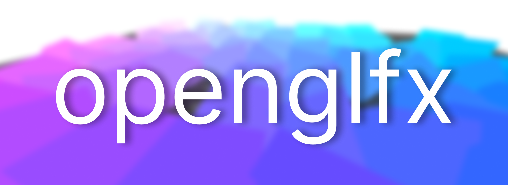

<a href="https://boosty.to/husker-dev/donate">
    
</a>

<a href="LICENSE"></a>
<a href="https://github.com/husker-dev/openglfx/releases/latest"></a>

# About

This library adds a new element to the JavaFX for rendering OpenGL graphics using LWJGL, JOGL, LWJGL2 or LibGDX. It is optimized for each platform and includes some auxiliary functions for working with OpenGL from JavaFX.

- [Dependency](#dependency)
- [Example](#example)
- [Usage](#usage)
  - [Rendering events](#rendering-events)
  - [Antialiasing (MSAA)](#antialiasing-msaa)
  - [Y-flipping](#y-flipping)
  - [OpenGL profile](#opengl-profile)
  - [FPS control](#fps-control)
  - [Image transfering](#image-transfering)
  - [RenderDoc](#renderdoc--nsight)
  - [LibGDX](#libgdx)
- [Under the hood](#under-the-hood)
- [Thanks to](#thanks-to)


> **NOTE:** All examples are written in Kotlin + Gradle + LWJGL. If you want to use Java/JOGL/Maven, you can use [example code generator](https://husker-dev.github.io/husker-dev/?page=tools/openglfx).

# Dependency
```groovy
dependencies {
    // implementation JavaFX
    // implementation LWJGL
    // implementation ...

    implementation 'com.huskerdev:openglfx-lwjgl:4.1.6'
}
```

Available modules:
  - ```openglfx-lwjgl```
  - ```openglfx-lwjgl2```
  - ```openglfx-jogl```
  - ```openglfx-libgdx```

If you are using java modules, then you need to add the following module in `module-info.java`:
```java
requires openglfx.lwjgl;
```
`openglfx` adds exports for JavaFX at runtime, but if you experience issues with package access, then add following arguments to launch configuration:
```
--add-exports=javafx.graphics/com.sun.prism=ALL-UNNAMED
--add-exports=javafx.graphics/com.sun.javafx.scene.layout=ALL-UNNAMED
--add-exports=javafx.graphics/com.sun.javafx.scene=ALL-UNNAMED
--add-exports=javafx.graphics/com.sun.javafx.sg.prism=ALL-UNNAMED
--add-exports=javafx.graphics/com.sun.scenario=ALL-UNNAMED
--add-exports=javafx.graphics/com.sun.javafx.tk=ALL-UNNAMED
--add-exports=javafx.graphics/com.sun.glass.ui=ALL-UNNAMED
```

# Example
https://github.com/husker-dev/openglfx-example

# Usage

This library adds only one component - ```GLCanvas```, that can be used like a regular element in JavaFX.

After canvas is not needed anymore, call ```dispose()``` to free the allocated memory.

```kotlin
import com.huskerdev.openglfx.canvas.GLCanvas
import com.huskerdev.openglfx.lwjgl.LWJGLExecutor.Companion.LWJGL_MODULE

val canvas = GLCanvas(LWJGL_MODULE)
```

Available modules:
  - ```LWJGL_MODULE```
  - ```LWJGL2_MODULE```
  - ```JOGL_MODULE```
  - ```LIBGDX_MODULE```
  

### Rendering events

```GLCanvas``` uses a logic similar to JOGL. The component has events where you can render the content.

```kotlin
canvas.addOnInitEvent { event ->
    // Init some gl properties only once
}

canvas.addOnRenderEvent { event ->
    // Render some content every frame
}

canvas.addOnReshapeEvent { event ->
    // Change viewport matrices at resizing
}

canvas.addOnDisposeEvent { event ->
    // Clear native data at disposing
}
```

### Antialiasing (MSAA)
```GLCanvas``` supports multi-sampling anti-aliasing. It can be enabled during creation.
For maximum possible MSAA level, specify -1.

```kotlin
GLCanvas(.., msaa = 4)
```

### Swap buffers
```GLCanvas``` based on the swap chain system - you can think of it as "double buffering".

The best UI performance is achieved with `2` (default). The most responsive to resizing is `1`.

```kotlin
GLCanvas(.., swapBuffers = 1)
```

### Y-flipping
By default, OpenGL draws the image upside down. ```GLCanvas``` has the ability to flip it without loss of performance. To do this, specify the parameter at startup.

```kotlin
GLCanvas(.., flipY = true)
```

### OpenGL profile

In GLCanvas you can specify the desired profile. I advise you to always choose Core. 
To do this, you need to specify a parameter in constructor.

```kotlin
GLCanvas(.., profile = GLProfile.CORE)
GLCanvas(.., profile = GLProfile.COMPATIBILITY)
```

### FPS control
If you need to update content with a certain FPS, then you should use property ```fps```. Keep in mind that JavaFX can limits the refresh rate.

| Value | Behavior                                                                                                                    |
|-------|-----------------------------------------------------------------------------------------------------------------------------|
| < 0   | Monitor refresh rate                                                                                                        |
| 0     | Do not updates automatically <br> (Keep in mind that the update may be triggered by resizing or other commands from JavaFX) |
| \> 0  | Update with desired FPS                                                                                                     |

```kotlin
// In constructor
val canvas = GLCanvas(..., fps = 30)

// Or at runtime
canvas.fps = 40
```

Don't forget to disable VSync before JavaFX initialization if you want to get FPS more than monitor's frequency.
```kotlin
System.setProperty("prism.vsync", "false")
```

### Image transfering
```openglfx``` has the ability to move images from JavaFX to OpenGL textures and vice versa. A special class is used for this:
```kotlin
val fbo = GLImageManager.toGL(image)

val image = GLImageManager.fromGL(fbo, width, height)
```

### RenderDoc & NSight
```openglfx``` supports RenderDoc integration.
To use it, you need to set `externalWindow` in GLCanvas constructor to `true`. 

This will create a separate window with the rendered image, which you can connect to via RenderDoc or NSight.

### LibGDX
To use in LibGDX project, you should create new module.

Minimal `build.gradle` example:
```groovy
plugins {
    id("org.jetbrains.kotlin.jvm")
}

sourceSets.main.resources.srcDirs += [ rootProject.file('assets').path ]

dependencies {
    implementation project(':core')
    implementation "com.badlogicgames.gdx:gdx-backend-lwjgl3:$gdxVersion"
    implementation "com.badlogicgames.gdx:gdx-platform:$gdxVersion:natives-desktop"

    // openglfx
    api("com.huskerdev:openglfx-libgdx:4.1.0")
  
    // implementation(/* JavaFX */)
    // implementation(/* LWJGL */)
}
```
Instead of using GLCanvas, you should use `LibGDXCanvas`:
```kotlin
val canvas = LibGDXCanvas(Main()) // Main is ApplicationAdapter
```

# Under the hood

- ### grapl
  [husker-dev/grapl](https://github.com/husker-dev/offscreen-jgl) is used to create offscreen thread-independent GL context on Windows, MacOS and Linux.

- ### GLExecutor
  Executors are the bridges from OpenGLFX inner logic to outer libraries like LWJGL or JOGL.
  
  |          | LWJGL  | JOGL |
  | -------- | ------ | ---- |
  |  Class   | [LWJGLExecutor.kt](https://github.com/husker-dev/openglfx/blob/master/modules/lwjgl/kotlin/com/huskerdev/openglfx/lwjgl/LWJGLExecutor.kt)  | [JOGLFXExecutor.kt](https://github.com/husker-dev/openglfx/blob/master/modules/jogl/kotlin/com/huskerdev/openglfx/jogl/JOGLFXExecutor.kt)  |
  | Instance | LWJGL_MODULE | JOGL_MODULE |

  If you want to add new OpenGL library, just create your implementation of [GLExecutor](https://github.com/husker-dev/openglfx/blob/master/modules/core/kotlin/com/huskerdev/openglfx/GLExecutor.kt) and use it as existing one: ```GLCanvas.create(YOUR_EXECUTOR_INSTANCE)```.

- ### Texture sharing

  To efficiently connect OpenGL and JavaFX, OpenGLFX uses some techniques based on OS and supported extensions.
  
  [BlitCanvas]: https://github.com/husker-dev/openglfx/blob/master/modules/core/kotlin/com/huskerdev/openglfx/internal/canvas/BlitCanvas.kt
  [ExternalObjectsCanvasFd]: https://github.com/husker-dev/openglfx/blob/master/modules/core/kotlin/com/huskerdev/openglfx/internal/canvas/ExternalObjectsCanvasFd.kt
  [ExternalObjectsCanvasWinD3D]: https://github.com/husker-dev/openglfx/blob/master/modules/core/kotlin/com/huskerdev/openglfx/internal/canvas/ExternalObjectsCanvasWinD3D.kt
  [ExternalObjectsCanvasWinES2]: https://github.com/husker-dev/openglfx/blob/master/modules/core/kotlin/com/huskerdev/openglfx/internal/canvas/ExternalObjectsCanvasWinES2.kt
  [IOSurface]: https://github.com/husker-dev/openglfx/blob/master/modules/core/kotlin/com/huskerdev/openglfx/internal/canvas/IOSurface.kt
  [WGLDXInteropCanvas]: https://github.com/husker-dev/openglfx/blob/master/modules/core/kotlin/com/huskerdev/openglfx/internal/canvas/WGLDXInteropCanvas.kt

  |                                                       | Description                                                                                                                                                                                    | Implementation                                                |
  |-------------------------------------------------------|------------------------------------------------------------------------------------------------------------------------------------------------------------------------------------------------|---------------------------------------------------------------|
  | **Windows** <br> (that supports EXT_external_objects) | [EXT_external_objects_win32](https://registry.khronos.org/OpenGL/extensions/EXT/EXT_external_objects_win32.txt) is used to create shared DXGI texture between DirectX 9 and OpenGL.            | [ExternalObjectsCanvasWinD3D.kt][ExternalObjectsCanvasWinD3D] |
  | **Windows** <br> (that supports WGL_NV_DX_interop)    | [NV_DX_interop](https://www.khronos.org/registry/OpenGL/extensions/NV/WGL_NV_DX_interop.txt) is used to synchronize textures between DirectX 9 and OpenGL.                                     | [WGLDXInteropCanvas.kt][WGLDXInteropCanvas]                   |
  | **Windows** <br> (es2 pipeline)                       | [EXT_external_objects_win32](https://registry.khronos.org/OpenGL/extensions/EXT/EXT_external_objects_win32.txt) is used to create chain with shared texture: <br> OpenGL <-> Vulkan <-> OpenGL | [ExternalObjectsCanvasWinES2.kt][ExternalObjectsCanvasWinES2] |
  | **Linux**                                             | [EXT_external_objects_fd](https://registry.khronos.org/OpenGL/extensions/EXT/EXT_external_objects_fd.txt) is used to create chain with shared texture: <br> OpenGL <-> Vulkan <-> OpenGL       | [ExternalObjectsCanvasFd.kt][ExternalObjectsCanvasFd]         |
  | **macOS**                                             | IOSurface is used to create memory block in VRAM that can be used in different OpenGL contexts.                                                                                                | [IOSurface.kt][IOSurface]                                     |
  | *Other*                                               | Copies ByteBuffer from ```glReadPixels``` to JavaFX texture                                                                                                                                    | [BlitCanvas.kt][BlitCanvas]                                   |


# Thanks to

- [streamingdv](https://github.com/streamingdv) - big donation, debugging
- [James H Ball](https://github.com/jameshball) - macOS tester
- [Andrew Hamilton](https://github.com/orange451) - macOS tester, suggested new additions
